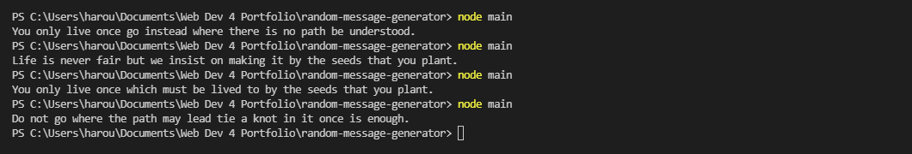
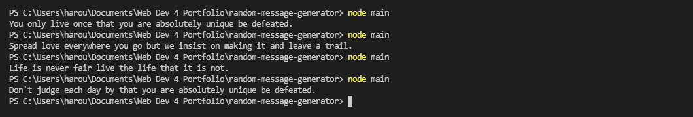

# Random Message Generator

> This is a portfolio project from codecademy. The aim is to generate random messages from different quotes.

## Table of Content

* [General Information](#general-information)
* [Tecknologies Used](#tecknologies-used)
* [Prerequisites](#prerequisites)
* [My Idea](#my-idea)
* [Screenshots](#screenshots)
* [Setup](#setup)
* [Launch](#launch)
* [Project Status](#project-status)
* [Contact Me](#contact-me)

## General Information

This is a codecademy's portfolio project aims to apply the basic and intermediate knowlegde of JavaScript, Git, Github, and command line.
And to practice writing readme files.

## Technologies Used

* JavaScript
* Node -v 14.17.5

## Prerequisites

I should created a message generator that should output a random message made of at least three different peices of data. The nature of the message is up to me.

## My Idea

My idea for this project is that I wanted to create the best quotes that could ever been said. So I thought about it on my own, and come up with the most genius idea ever.
I've gone to blog.hubspot.com and look up the 100 most famous quotes of all time. So as a demo I chose 15 of them that I liked, and split them among ~~us~~ three arrays, and randomly combined between all these components to create the perfect message for you.
I would say I succeeded tremandously... I think.

## Screenshots

## Setup

To setup the project you need to download the repository, and open it with VS Code or your favorite code editor.

## Lanuch

To run the program type in the terminal: `node main`

## Project Status

There is currently no plans to expand upon it.

## Contact Me

Created by [@harounehadid](https://github.com/harounehadid) - feel free to contact me at [LinkedIn](https://www.linkedin.com/in/harounehadid/).
